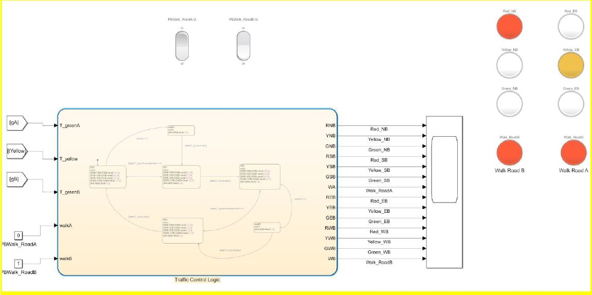

# Traffic Light Control

## Description
* Designed the logic behind the new control scheme to maximize traffic throughput at an intersection.
* The control algorithm and sensor system must minimize the total amount of time that people wait at the intersection

## Usage
* Open JonasTrafficLightController.slx using Simulink and run the file

* For traffic saturation and timing information, open and run TrafficFlowEq.m

## Author
* Jonas Chianu